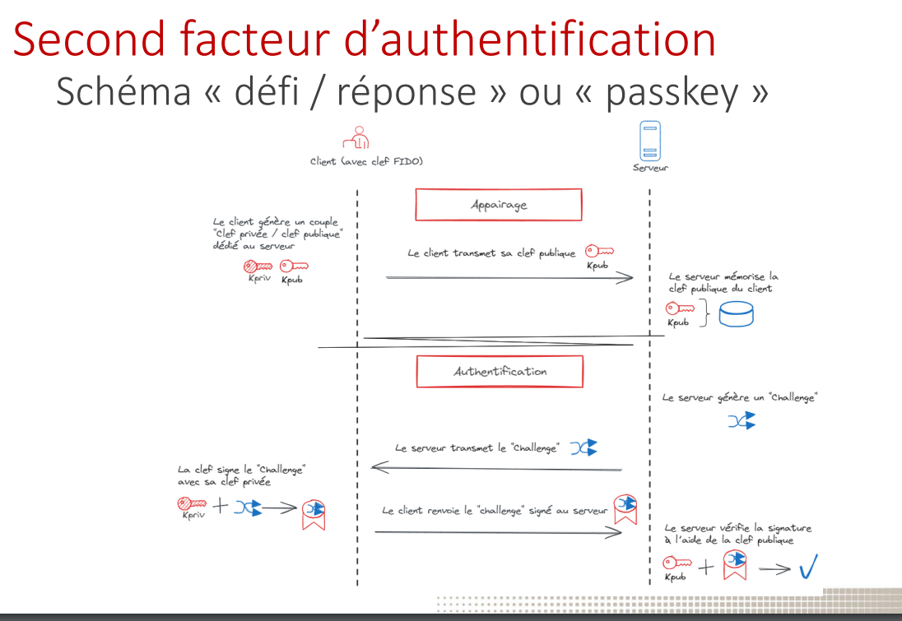
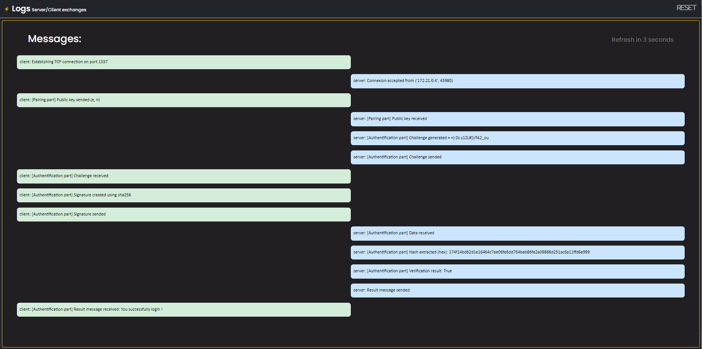
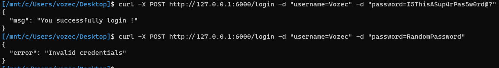

# Description de l'objectif de sécurité visé et conclusion (4 points / 20):
## Description
Le projet consiste à reproduire un schéma d'authentification à deuxième facteur en Python.
Le lab. se compose de deux machines pour reproduire l'échange "défi/réponse", et d'une troisième machine contenant un serveur web à des fins de journalisation.
Les machines **client** et **serveur** communiquent entre elles via un socket TCP. Le serveur attend les nouvelles connexions et déclenche une deuxième vérification d'identité avec le client pour chacune d'entre elles. Cette vérification est basée sur la signature d'un challenge généré et vérifié par le serveur. Le schéma se décompose donc en deux phases, l'une appelée ``appairage``, qui sert à partager la clé publique du client, et une seconde appelée ``authentification``, qui vise à vérifier que l'identité qui demande une connexion est bien le propriétaire de la clé.

Pour des raisons pratiques et de démonstration, ces deux parties sont exécutées successivement dans le code proposé. Évidemment, dans le monde réel, l'appairage aurait lieu en présence d'un administrateur/configuration de compte, et l'authentification aurait lieu à chaque connexion.

De plus, un serveur web développé en *Fask* sur une 3ème machine permet de visualiser proprement les différents échanges entre client/serveur et d'avoir une vue d'ensemble du processus.

Le fichier ``TP_SEC105_SCHEMA.drawio`` détail le fonctionnement des communications des 3 machines.

L'objectif principal de ce schéma est de garantir l'identité légitime d'une entité (utilisateur, appareil, service) en vérifiant sa capacité à répondre correctement à un défi spécifique.

Voici la liste des objectifs de sécurité visé par le schéma d'épreuve/réponse :
- Résistance aux attaques par force brute
- Protection contre les attaques replay
- Protection aux attaques de type Man-In-The-Middle (MITM) 
- Authentification sécurisée & Facilité d'utilisation


## Conclusion
Le schéma d'épreuve/réponse offre une méthode robuste et fiable pour l'authentification et permet d'assurer une couche de protection suplémentaire aux mots-de-passes courant lors de l'identification d'un individu.



# Installation:
```bash
docker-compose up --build
```

## Serveur de log: 
- curl http://127.0.0.1:1111


## Déclenchement de la procédure de connection:
```bash
curl http://127.0.0.1:6000/login
```



# Sources (4 points / 20):
## Docs:
- https://docs.docker.com/compose/
- https://flask-fr.readthedocs.io/index.html
- https://docs.python.org/3/library/socket.html
- https://github.com/Gallopsled/pwntools
## Articles:
- https://www.di.ens.fr/~nitulesc/files/crypto6.pdf
- https://cedricvanrompay.gitlab.io/tp-rsa/instructions.html
- https://vozec.fr/rsa/rsa-9-breaking-signature-shema/
- https://fr.wikipedia.org/wiki/Chiffrement_RSA
